Django GIS Brasil
========================================================

.. toctree::
   :maxdepth: 2

Release v\ |version|. (:ref:`installation`)

**django-gis-brasil** é uma iniciativa open-source da CodeFi.sh (*Christian S. Perone, Leandro Nunes e Gabriel Wainer*)
para a criação de uma aplicação Django com informações geográficas do território brasileiro. O projeto contém atualmente
informações de todos municípios brasileiros fornecidos pelo IBGE bem como polígonos geográficos
prontos para serem importados no seu banco geográfico através do `GeoDjango <https://docs.djangoproject.com/en/dev/ref/contrib/gis/tutorial/>`_. 

A aplicação django-gis-brasil realiza a importação de forma automática das informações geográficas
para o seu banco geográfico. A aplicação também conta com a parte administrativa já modelada para
todos os dados disponíveis (ver :ref:`screenshots`) abaixo.

.. _screenshots:

Screenshots
========================================================

Listagem de Munícipios do Brasil
--------------------------------------------------------

Todos modelos de dados incluem administração do Django implementada.

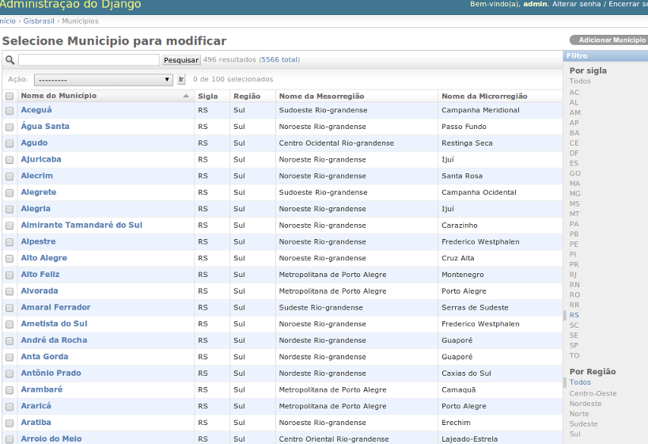

Pesquisa de Municípios
--------------------------------------------------------

Todos modelos de dados incluem pesquisa nos campos.

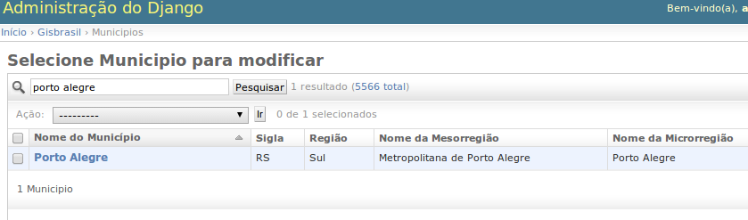

Dados Geográficos
--------------------------------------------------------

Todos modelos de dados incluem polígonos geográficos.

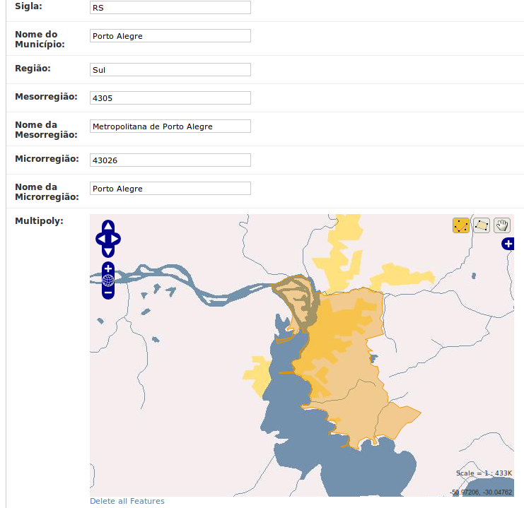

Informação Bairros
--------------------------------------------------------

Informações geográficas (incluindo polígonos geográficos de bairros).

*(Por hora, disponível apenas em Porto Alegre/RS)*:

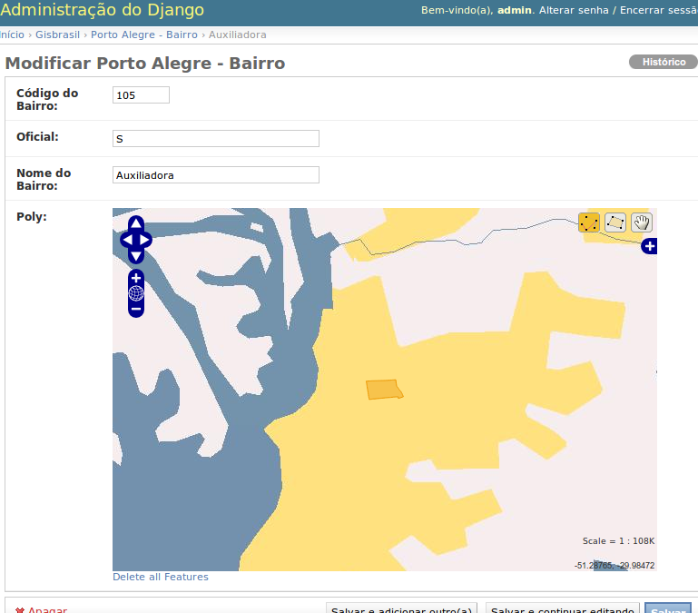

Pesquisas Geográficas
========================================================

Utilizando o GeoDjango você pode fazer pesquisas geográficas, serializar dados
automaticamente para o formato GeoJSON e outras facilidades mostradas nos
exemplos abaixo.

Procurando por cidade
--------------------------------------------------------

Neste exemplo, a cidade de "Porto Alegre" é encontrada e serializamos o polígono
geográfico referente ao município em GeoJSON::

    >>> from gisbrasil.models import *
    >>> cidade = Municipio.objects.get(nome_municipio__iexact='Porto Alegre')
    >>> cidade.multipoly.json
    u'{ "type": "MultiPolygon", "coordinates": 
        [ [ [ [ -51.233122078168442, -29.937217337009614 ], 
        [ -51.220177248016007, -29.96659503107206 ],
    (... omitido por brevidade ...)

Procurando por Latitude/Longitude
--------------------------------------------------------

Neste exemplo, temos a coordenada Latitude -51.22 e a Longitude -30.03 e queremos
encontrar detalhes da cidade que contém esta coordenada (tudo isto usando apenas
uma pesquisa geográfica no banco de dados, sem acesso ao Google Maps ou qualquer
outro serviço)::

    >>> from gisbrasil.models import *
    >>> from django.contrib.gis.geos import Point
    >>> coordenada = Point(-51.22, -30.03)
    >>> qs = Municipio.objects.filter(multipoly__contains=coordenada)
    >>> qs
    [<Municipio: Porto Alegre>]

Como podemos notar, a cidade de "Porto Alegre" contém a coordenada especificada.

Para mais informações sobre como usar as pesquisas geográficas, veja a documentação
do `GeoDjango <https://docs.djangoproject.com/en/dev/ref/contrib/gis/tutorial/>`_.

Criação de mapas com TileMill
========================================================

Você pode utilizar o `TileMill <http://www.mapbox.com/tilemill/>`_ para conectar no seu banco
geográfico e gerar mapas com estilos customizados utilizando os dados do Django GIS Brasil,
isto tudo utilizando apenas software open-source. Veja exemplos abaixo.

Todos Municípios do Brasil
------------------------------------------------------------------------------

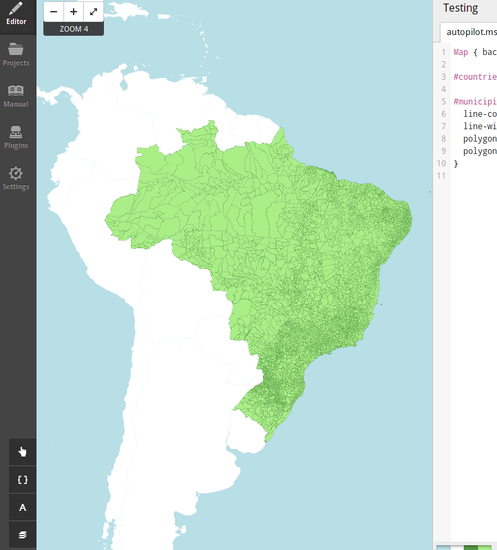

Bairros de Porto Alegre
------------------------------------------------------------------------------

.. image:: _static/tilemill-bairros-poa.png

Utilizando informações em rótulos
------------------------------------------------------------------------------

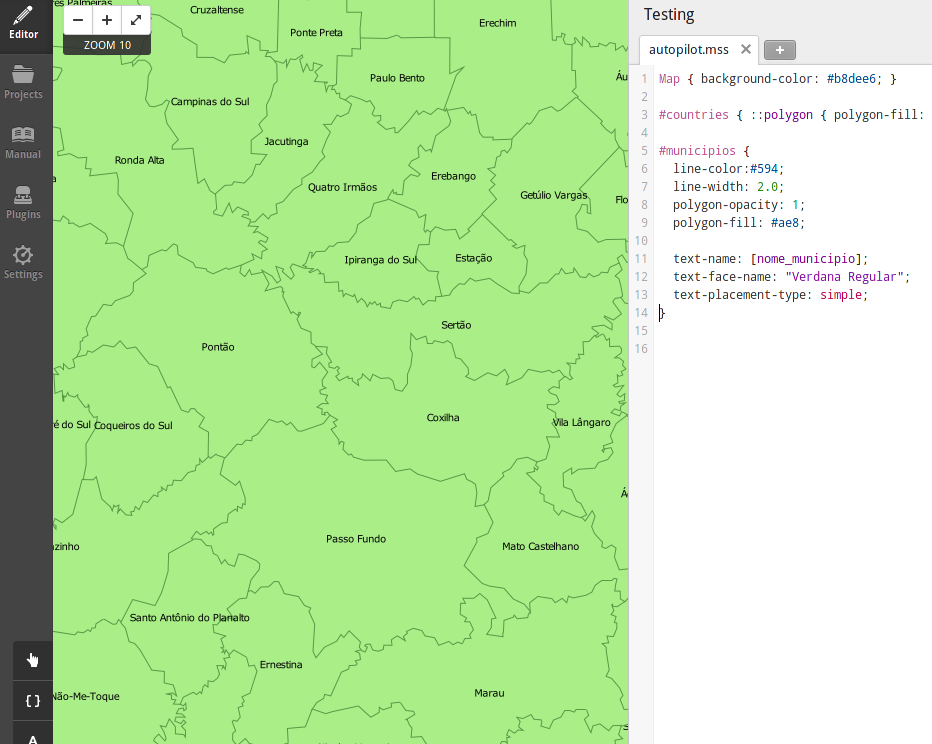

Dados dos Acidentes em Porto Alegre / RS
------------------------------------------------------------------------------

A imagem abaixo mostra o plot dos acidentes de trânsito em Porto Alegre / RS durante os anos
de 2000 até 2012. Quanto maior o marcador é onde houveram mais feridos no acidente.

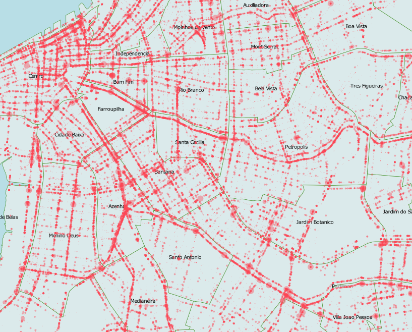

Mapa com estilo noturno para Porto Alegre / RS
------------------------------------------------------------------------------

Este é um mapa noturno da cidade de Porto Alegre / RS, customizado utilizando
o TileMill com os dados do Django GIS Brasil utilizando somente softwares open-source.

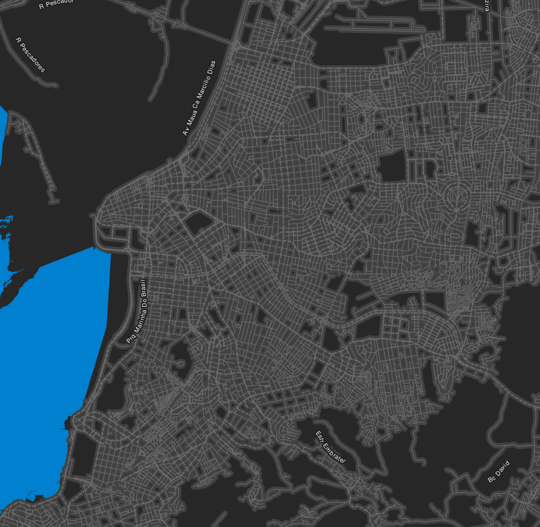

Mapa ao estilo Google Maps com texturas
------------------------------------------------------------------------------

Este é um mapa da cidade de Porto Alegre / RS, customizado para imitar o estilo
de cores do Google Maps e mais algumas texturas extras, utilziando softwares open-source.

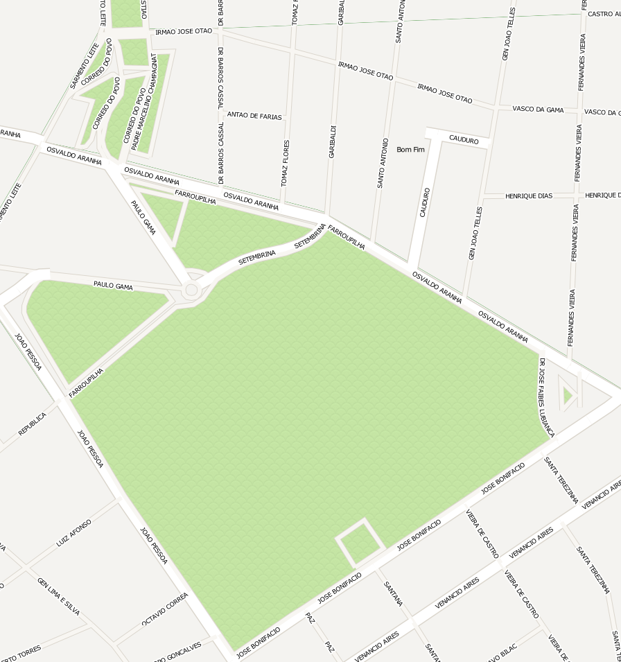

Mapa de calor (heatmap) de Acidentes de Trânsito de Porto Alegre / RS
------------------------------------------------------------------------------

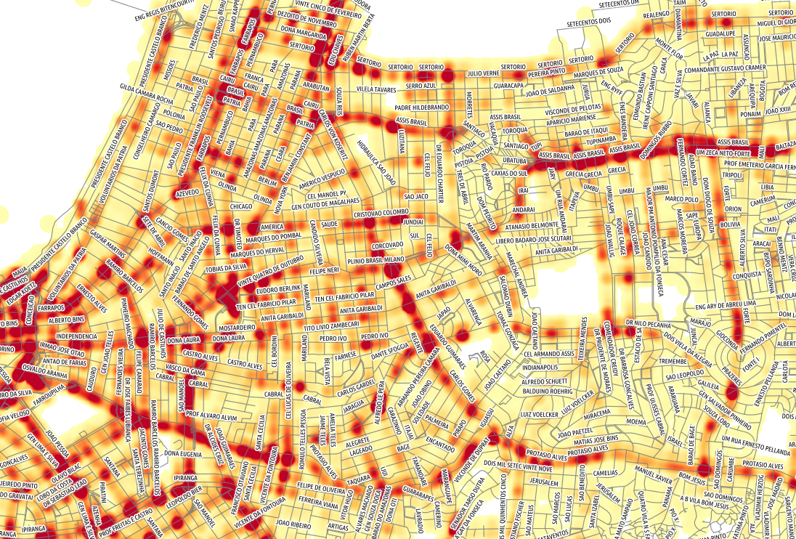

Mapas coropléticos
========================================================

Você também pode utilizar o GeoJSON gerado utilizando os dados do Django GIS Brasil para
criar **mapas coropléticos** interativos utilizando o `Leaflet <http://leafletjs.com/>`_
como nos exemplos abaixo.

Mapa coroplético do Rio Grande do Sul
--------------------------------------------------------

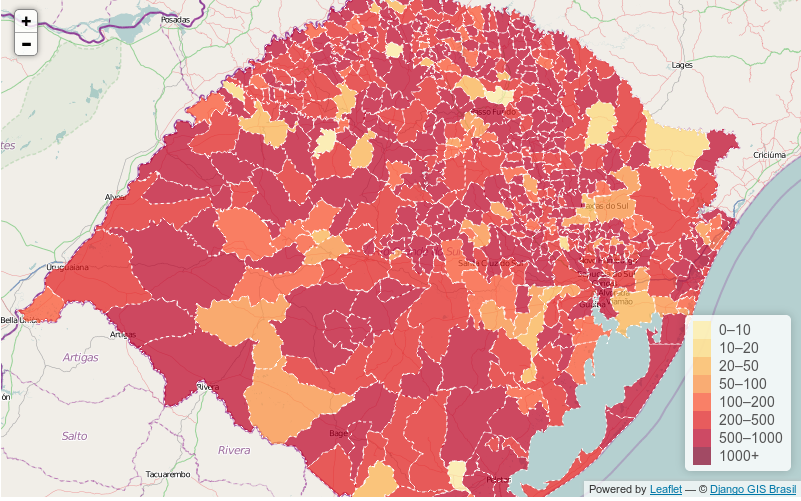

Mapa coroplético do Rio de Janeiro
--------------------------------------------------------

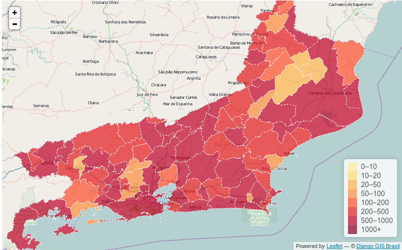

.. _installation:

Instalação
========================================================

.. .. warning:: test

Siga as instruções abaixo para instalar esta aplicação no seu projeto Django.

1. Instale o django-gis-brasil através do `pip` ou `easy_install`::

    pip install django-gis-brasil

2. Adicione a aplicação "gisbrasil" na propriedade `INSTALLED_APPS` do seu projeto Django::

    INSTALLED_APPS = (
        ...
        'gisbrasil',
    )

3. Execute::

    python manage.py syncdb

para criar os modelos no seu banco de dados.

4. Execute::

    python manage.py gisloader

Note que ao executar o `gisloader` sem parâmetros o Django GIS Brasil irá importar todos datasets,
isto pode levar algum tempo e irá utilizar a sua rede para fazer o download dos datasets quando
necessário. Para fazer a importação seletiva, ou seja, importar apenas dados específicos utilize
a importação seletiva como mostrado abaixo no próximo tópico.

.. note:: É natural que a importação dos conjuntos de dados demore devido a quantidade de registros
          que são inseridos no Banco de Dados do Django.

Importação seletiva de datasets
--------------------------------------------------------

Para importar apenas alguns conjuntos de dados, passe por parâmetro para o gisloader o nome
do *dataset* que você deseja importar. Para listar os *datasets* disponíveis, execute o *help*
do `gisloader` como no exemplo abaixo::

    python manage.py gisloader --help

    Usage: manage.py gisloader [options] 
    Load the GIS data from the datasets into the database.

    Options:
      -v VERBOSITY, --verbosity=VERBOSITY
                            Verbosity level; 0=minimal output, 1=normal output,
                            2=verbose output, 3=very verbose output
      --settings=SETTINGS   The Python path to a settings module, e.g.
                            "myproject.settings.main". If this isn't provided, the
                            DJANGO_SETTINGS_MODULE environment variable will be
                            used.
      --pythonpath=PYTHONPATH
                            A directory to add to the Python path, e.g.
                            "/home/djangoprojects/myproject".
      --traceback           Raise on exception
      --municipios-brasil   Dados de Municípios do Brasil
      --bairros-portoalegre
                            Dados de Bairros de Porto Alegre / RS
      --acid-transito-portoalegre
                            Dados de Acidentes de Trânsito de Porto Alegre / RS
      --bikepoa-portoalegre
                            Dados de Estações BikePoa de Porto Alegre / RS
      --taxi-portoalegre    Dados de Pontos de Táxi de Porto Alegre / RS
      --onibus-portoalegre  Dados de Paradas de Ônibus de Porto Alegre / RS
      --eixos-portoalegre   Dados de Eixos (ruas, avenidas, etc) de Porto Alegre /
                            RS
      --version             show program's version number and exit
      -h, --help            show this help message and exit

Para importar por exemplo apenas o conjunto de dados de **Paradas de Ônibus** em Porto Alegre/RS,
basta utilizar o respectivo parâmetro para realizar a importação como no exemplo abaixo::
  
  python manage.py gisloader --onibus-portoalegre

Changelog
========================================================

Release v.0.4
--------------------------------------------------------
    - Integração do dataset de **Estações Rádio Base de Porto Alegre** de Porto ALegre/RS,
      disponibilizado pela prefeitura do município no projeto `DataPoa <http://www.datapoa.com.br/>`_ ;

Release v.0.3 
--------------------------------------------------------

    - Corrigidos problemas com encoding de shapefiles;
    - *Refactoring* do sistema de importação de datasets;
    - Implementação da importação seletiva (agora o usuário pode escolher
      quais datasets quer importar);
    - Melhorias na documentação;
    - Integração dos mapas de eixos (ruas, avenidas, etc) de Porto Alegre / RS;
    - Integração do dataset de **Acidentes de Trânsito** em
      Porto Alegre/RS dos anos de 2000 até 2012, disponibilizado
      pela prefeitura no projeto `DataPoa <http://www.datapoa.com.br/>`_ ;
    - Integração do dataset de **Estacões do BikePoa** de Porto ALegre/RS, disponibilizado
      pela prefeitura do município no projeto `DataPoa <http://www.datapoa.com.br/>`_ ;
    - Integração do dataset de **Pontos de Táxi** de Porto Alegre/RS, disponibilizado
      pela prefeitura do município no projeto `DataPoa <http://www.datapoa.com.br/>`_ ;
    - Integração do dataset de **Paradas de Ônibus** de Porto Alegre/RS, disponibilizado
      pela prefeitura do município no projeto `DataPoa <http://www.datapoa.com.br/>`_ ;

Release v.0.2 *(bug fix)*
--------------------------------------------------------

    - Corrigidos alguns typos na documentação;
    - Corrigido empacotamento da aplicação;

Release v.0.1 
--------------------------------------------------------

    - Lançamento do projeto open-source;

Licença
========================================================

Mais informações::

    Copyright (c) 2013, CodeFi.sh
    All rights reserved.

    Redistribution and use in source and binary forms, with or without
    modification, are permitted provided that the following conditions are met:
    1. Redistributions of source code must retain the above copyright
       notice, this list of conditions and the following disclaimer.
    2. Redistributions in binary form must reproduce the above copyright
       notice, this list of conditions and the following disclaimer in the
       documentation and/or other materials provided with the distribution.
    3. All advertising materials mentioning features or use of this software
       must display the following acknowledgement:
       This product includes software developed by CodeFi.sh.
    4. Neither the name of the CodeFi.sh nor the
       names of its contributors may be used to endorse or promote products
       derived from this software without specific prior written permission.

    * This software contains data public available from other sources, see
      the README files on each data directory for more information.

    THIS SOFTWARE IS PROVIDED BY CODEFI.SH ''AS IS'' AND ANY
    EXPRESS OR IMPLIED WARRANTIES, INCLUDING, BUT NOT LIMITED TO, THE IMPLIED
    WARRANTIES OF MERCHANTABILITY AND FITNESS FOR A PARTICULAR PURPOSE ARE
    DISCLAIMED. IN NO EVENT SHALL CODEFI.SH BE LIABLE FOR ANY
    DIRECT, INDIRECT, INCIDENTAL, SPECIAL, EXEMPLARY, OR CONSEQUENTIAL DAMAGES
    (INCLUDING, BUT NOT LIMITED TO, PROCUREMENT OF SUBSTITUTE GOODS OR SERVICES;
    LOSS OF USE, DATA, OR PROFITS; OR BUSINESS INTERRUPTION) HOWEVER CAUSED AND
    ON ANY THEORY OF LIABILITY, WHETHER IN CONTRACT, STRICT LIABILITY, OR TORT
    (INCLUDING NEGLIGENCE OR OTHERWISE) ARISING IN ANY WAY OUT OF THE USE OF THIS
    SOFTWARE, EVEN IF ADVISED OF THE POSSIBILITY OF SUCH DAMAGE.

Colaboradores
--------------------------------------------------------

Christian S. Perone (CodeFi.sh) `[twitter] <http://www.twitter.com/tarantulae>`_ 
`[blog] <http://pyevolve.sourceforge.net/wordpress>`_ `[github] <https://github.com/perone>`_.

Gabriel Wainer (CodeFi.sh) `[twitter] <http://www.twitter.com/gabrielcwww>`_ `[github] <https://github.com/gwainer>`_.

Leandro Nunes (CodeFi.sh) `[twitter] <http://www.twitter.com/nunesleandro>`_ 
`[blog] <http://leandron.wordpress.com/>`_ `[github] <https://github.com/leandron>`_.

Página de pesquisa
========================================================

* :ref:`search`

